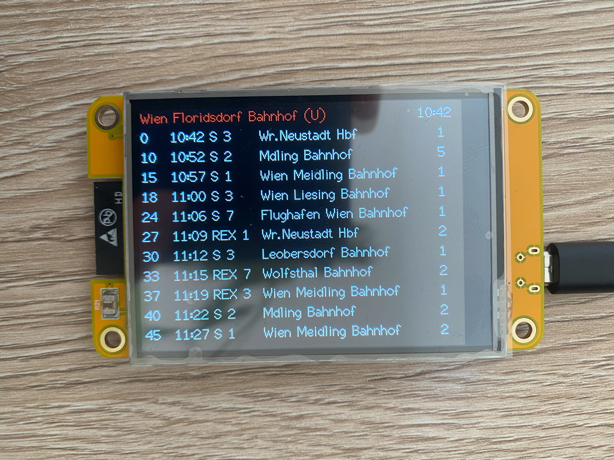

# CYD ÖBB Abfahrtsmonitor



Public Transport Monitor for the austrian public train service ÖBB. Can also display other austrian public transport services like Wiener Linien.
Can display multiple pages. Switch pages left and right on the touchscreen. Reload page by pressing the top of the touchscreen.

[CYD Aliexpress](https://de.aliexpress.com/item/1005004961285750.html?aff_fcid=75d5121dd0b844bf9db3c8060445c3d1-1741711174865-05199-_DkSpIjB&tt=CPS_NORMAL&aff_fsk=_DkSpIjB&aff_platform=shareComponent-detail&aff_trace_key=75d5121dd0b844bf9db3c8060445c3d1-1741711174865-05199-_DkSpIjB&afSmartRedirect=y)

Use [ÖBB Link Creator](https://github.com/Dave2ooo/oebb-link-creator) then find the `fahrplan.oebb.at` url (using Developertools).

### Credentials

Needs a `credentials.h`

```c
String credentials[][2] = {
    {"WifiSSID", "WifiPassword"},
    {"OptionalOtherSSID", "OptionalOtherSSDPassword"},
};
```

## TODO

- ~~Format als tabelle~~
- ~~Verspätete Rot~~
- ~~To be tested: rt status cancled rot? "trChg":false,"rt":{"status":"Ausfall","dlm":"","dlt":"","dld":""},"rta":{"status":"Ausfall","dlm":"","dlt":""}}~~
- Gleis änderungen gelb
- ~~Aktuelle Zeit~~
- ~~abfahrt in minuten~~
- ~~mehrere monitore (wechsel über touchscreen)~~
- ~~bunte überschriften~~
- loading animation between pages (not possible without async)
- ~~RGB LED OFF (cant turn off)~~
- ~~sleep~~
- ~~wake up über touchscreen (nicht möglich?)~~
- ~~[3d print case](https://www.printables.com/model/685845-enclosure-for-sunton-esp32-2432s028r-cheap-yellow-)~~
- umlaute
